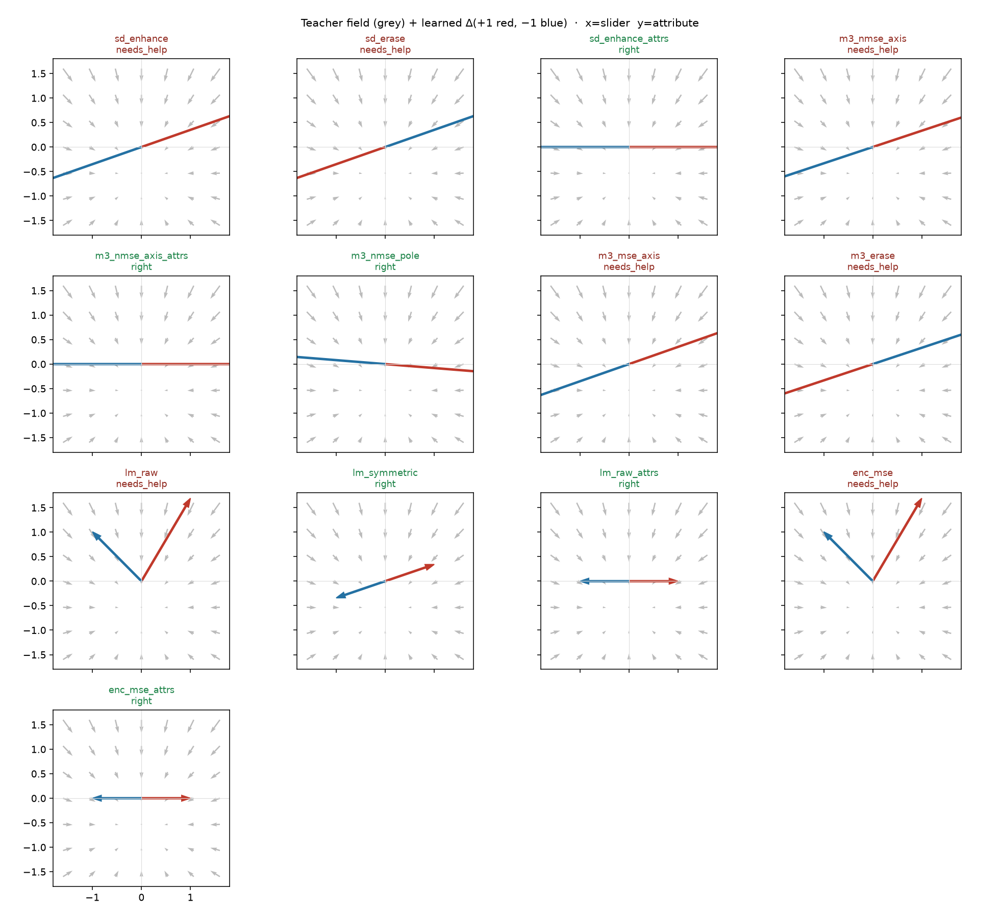
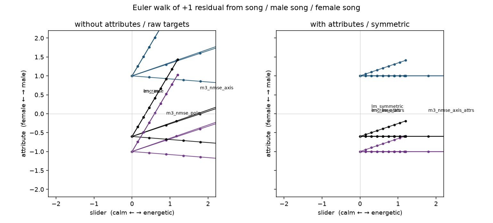
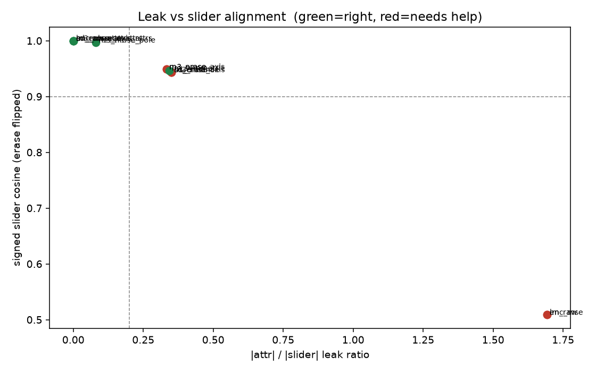

# 2-D CPU analysis of slider methods

Synthetic orthonormal field. Slider axis is **energetic ↔ calm**;
attribute axis is **male ↔ female**. Ungated `energetic` leaks male
and both poles sit above a quiet `song` (even / common mode).
No Hub, no GPU, no Music 3 weights.

## Verdict

| method | verdict | slider cos | leak | ±1 cos | why |
|---|---|---:|---:|---:|---|
| `sd_enhance` | **needs_help** | 0.944 | 0.350 | -1.000 | slider axis is right; leak 0.35 (expected without attributes) |
| `sd_erase` | **needs_help** | -0.944 | -0.350 | -1.000 | slider axis is right; leak 0.35 (expected without attributes) |
| `sd_enhance_attrs` | **right** | 1.000 | 0.000 | -1.000 | tracks the slider, attribute leak is small, ±1 are opposite |
| `m3_nmse_axis` | **needs_help** | 0.949 | 0.333 | -1.000 | slider axis is right; leak 0.33 (expected without attributes) |
| `m3_nmse_axis_attrs` | **right** | 1.000 | 0.000 | -1.000 | tracks the slider, attribute leak is small, ±1 are opposite |
| `m3_nmse_pole` | **right** | 0.997 | -0.081 | -1.000 | tracks slider, little leak |
| `m3_mse_axis` | **needs_help** | 0.944 | 0.350 | -1.000 | slider axis is right; leak 0.35 (expected without attributes) |
| `m3_erase` | **needs_help** | -0.949 | -0.333 | -1.000 | slider axis is right; leak 0.33 (expected without attributes) |
| `lm_raw` | **needs_help** | 0.509 | 1.692 | 0.253 | raw pos/neg share an even mode; ±1 cos=0.25 |
| `lm_symmetric` | **right** | 0.946 | 0.342 | -1.000 | ±1 opposite on the slider; leak 0.34 remains without attributes |
| `lm_raw_attrs` | **right** | 1.000 | 0.000 | -1.000 | symmetric / odd targets keep ±1 opposite on the slider |
| `enc_mse` | **needs_help** | 0.509 | 1.692 | 0.253 | raw pos/neg share an even mode; ±1 cos=0.25 |
| `enc_mse_attrs` | **right** | 1.000 | 0.000 | -1.000 | symmetric / odd targets keep ±1 opposite on the slider |







## What this field can see

- SD enhance/erase and Music 3 TF (`nmse` / `mse` / `pole` / `axis`)
  use the same `neu ± g·(pos − neg)` (or pole) target. On this field
  they agree: the slider axis is right; **without `--attributes` the
  attribute axis leaks**.
- `--attributes male,female` pins gender on every caption. The
  pos−neg difference becomes parallel to the slider — paper
  disentangle is geometrically right here.
- Music 3 `pole` vs `axis`: neu is off the pos−neg chord, so the
  even (common) part differs. An odd LoRA multiplier cannot represent
  that even part. `nmse` + pole also reweights the two edges by
  `1/||edge||²`, so the odd fit is not exactly `(pos-neg)/2`.
- LM `--symmetric` (default) keeps ±1 opposite. The *axis* is still
  whatever pos−neg is, so ungated leak remains. Attribute-prefixed
  raw targets also stay antipodal (pinned gender cancels in pos−neg).
  Raw LM/encoder targets without attributes learn the shared even
  mode → collapse. That matches gender-lm v2 → v3 in MUSIC3.md.

## What this field cannot see

- Real multi-row Music 3 captions whose slider axes are *not*
  parallel (MUSIC3.md: attributes averaging destroys TF style
  sliders). Additive prefixes here always cancel.
- Pixels, CLAP, render gates, AR endreg/planreg, `uncond_weight`,
  trajectory training, gain compounding across a 50-step solve.
- `train_lora.py` (SD1) is stale against `prompt_util.py` (wrong
  `PromptEmbedsPair` arity and `unconditional_latents` kwarg).
  Scored is the XL/SD3 formula and the SD1 *intent*.

## How to run

```bash
PYTHONPATH=. python analysis/slider2d/run_analysis.py --out docs/2d-analysis
PYTHONPATH=. pytest tests/test_2d_slider_geometry.py -q
```

Shared loss extract: `conceptmod/textsliders/slider_targets.py`.
`train_lora_music3.py` imports `music3_slider_loss` from there.
The GPU trainers were not rewritten beyond that import.

Seed `0`, `250` Adam steps, CPU.

See [tf-leak.md](tf-leak.md) for whether that gender leak is a Music 3 TF
trainer bug (it is not) or caption BPM sitting inside `pos − neg` (it is).

